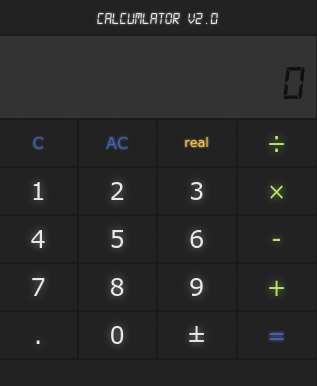

# CalcuMLator

`CalcuMLator` is a calculator that utilizes <b>Machine Learning</b> to predict the values.



#### Check it running [here](https://calcumlator.herokuapp.com/).

I'm hosting the backend of the project at [heroku](https://www.heroku.com/) with
a free plan. It may take a little to fire up the servers there. The page contains
more information about the calculator.

If you wish to run the project locally, clone the repository and install the dependencies.
Then you can start a web server with [gunicorn](http://gunicorn.org/). If you don't
want to install the dependencies globally, try running inside a [virtualenv](https://virtualenv.pypa.io/en/stable/)
```bash
$ git clone https://github.com/luxedo/calcuMLator.git
$ cd calcuMLator
$ pip install -r requirements.txt
$ gunicorn server:app
```
## Microservice API
To call the microservice, use the following address:
`https://calcumlator.herokuapp.com/compute`
with the following queries:
* `n1` - the first number of the calculation
* `n2` - the second number of the calculation
* `op` - the operation to be performed (`add`, `sub`, `mul`, `div`)
* `method` - the regression method (`real`, `linear`, `ridge`, `lasso`, `elastic`, `bayesian`, `theil`, `PAR`, `SVR`, `bagging`, `dtree`, `gaussian`, `PLS`, `MLP`, `knnr`, `k_ridge`, `forest`)

eg:

> GET https://calcumlator.herokuapp.com/compute?n1=10&n2=20&op=add&method=gaussian
>
> {
>  "result": 29.999900352733675
> }


Thanks to `Rafael Hamasaki` for the help with the UI.
