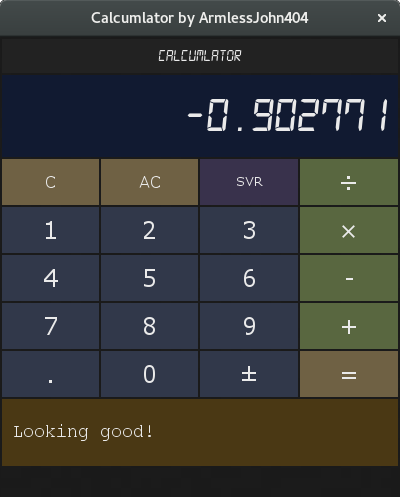

# CalcuMLator

`CalcuMLator` is a calculator that utilizes <b>Machine Learning</b> to predict the values. It uses [`electron`](http://electron.atom.io/) to run a webapp.

Dependencies are [`python3`](https://www.python.org/), [`numpy`](http://www.numpy.org/), [`sklearn`](http://scikit-learn.org/stable/) and [`nodejs`](https://nodejs.org/en/). If you intend to plot the data, also download and install [`matplotlib`](http://matplotlib.org/)
To install, clone this repository, install the `node` dependencies and run the package script.
```bash
$ git clone git@github.com:ArmlessJohn404/calcuMLator.git
$ cd app
...
$ npm install
...
```
Run the app with
```bash
$ npm start
or
$ electron .
```
Currently, the [Web interface](http://armlessjohn404.github.io/calcuMLator) does not support `node.js` nor `python` so it's simulating a regular calculator. Please check it out to find out more about the project.
